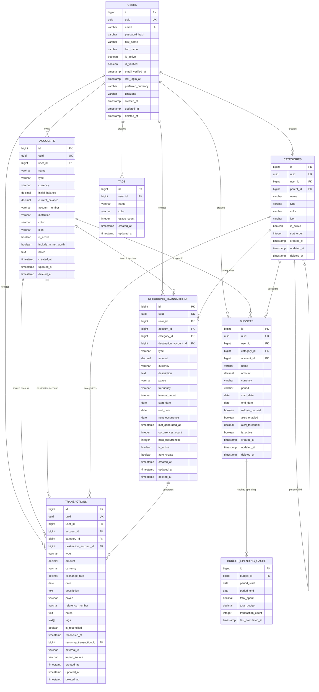
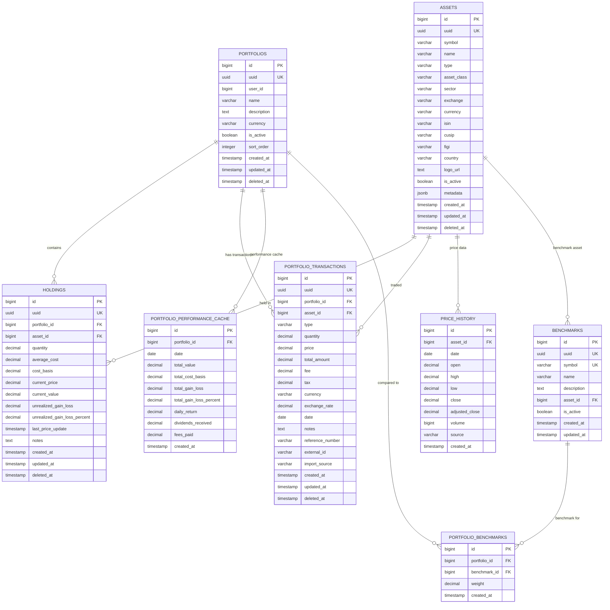
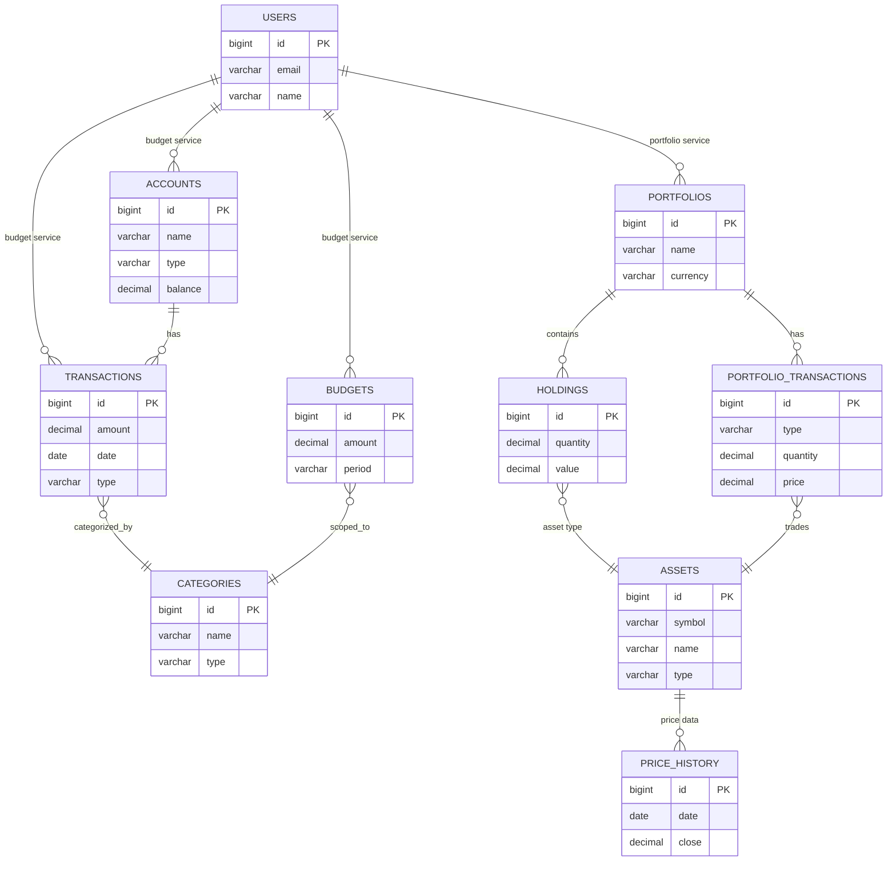

# Entity Relationship Diagrams (ERD)

This document contains the ERD for FinCloud's database schema using Mermaid diagram syntax.

## How to Generate PNG

### Method 1: Using Mermaid CLI

```bash
# Install Mermaid CLI
npm install -g @mermaid-js/mermaid-cli

# Generate Budget Service ERD
mmdc -i docs/architecture/erd-diagram.md -o docs/architecture/erd-budget-service.png -b transparent

# Generate Portfolio Service ERD
mmdc -i docs/architecture/erd-diagram.md -o docs/architecture/erd-portfolio-service.png -b transparent
```

### Method 2: Using Online Tools

1. Visit [Mermaid Live Editor](https://mermaid.live/)
2. Copy the Mermaid code below
3. Export as PNG/SVG

### Method 3: Using draw.io

1. Visit [draw.io](https://app.diagrams.net/)
2. Import the database schema from the markdown file
3. Use the database import feature or create manually
4. Export as PNG

---

## Budget Service ERD



---

## Portfolio Service ERD



---

## Complete System ERD (Simplified)

This diagram shows the high-level relationships between Budget and Portfolio services.



---

## Database Schema Visual Summary

### Budget Service Tables (8 tables)

1. **users** - User accounts and authentication
2. **accounts** - Financial accounts (bank, credit, etc.)
3. **categories** - Transaction categories (hierarchical)
4. **transactions** - Financial transactions
5. **budgets** - Budget allocations
6. **recurring_transactions** - Recurring transaction templates
7. **tags** - Reusable tags
8. **budget_spending_cache** - Performance cache

### Portfolio Service Tables (8 tables)

1. **portfolios** - Investment portfolios
2. **assets** - Investment assets (stocks, crypto, etc.)
3. **holdings** - Current positions
4. **portfolio_transactions** - Buy/sell transactions
5. **price_history** - Historical prices
6. **portfolio_performance_cache** - Performance metrics cache
7. **benchmarks** - Market benchmarks
8. **portfolio_benchmarks** - Portfolio-benchmark relationships

### Key Relationships

**Budget Service:**
- One user → Many accounts
- One account → Many transactions
- One category → Many transactions (and subcategories)
- One budget → One category/account
- One recurring transaction → Many generated transactions

**Portfolio Service:**
- One user → Many portfolios
- One portfolio → Many holdings
- One asset → Many holdings (across portfolios)
- One portfolio → Many transactions
- One asset → Many price history records

---

## Converting to PNG

### Using Mermaid CLI (Recommended)

```bash
# Install dependencies
npm install -g @mermaid-js/mermaid-cli

# Generate Budget Service ERD
echo '```mermaid' > budget-erd.mmd
# Copy the Budget Service ERD from above
echo '```' >> budget-erd.mmd
mmdc -i budget-erd.mmd -o docs/architecture/erd-budget-service.png

# Generate Portfolio Service ERD
echo '```mermaid' > portfolio-erd.mmd
# Copy the Portfolio Service ERD from above
echo '```' >> portfolio-erd.mmd
mmdc -i portfolio-erd.mmd -o docs/architecture/erd-portfolio-service.png

# Generate Complete System ERD
echo '```mermaid' > system-erd.mmd
# Copy the Complete System ERD from above
echo '```' >> system-erd.mmd
mmdc -i system-erd.mmd -o docs/architecture/erd-system.png
```

### Manual Creation with draw.io

If you prefer a more visual tool:

1. Visit [draw.io](https://app.diagrams.net/)
2. Create a new diagram
3. Use the Entity Relation shape library
4. Refer to `database-schema.md` for all fields and relationships
5. Export as PNG with transparent background

**Recommended Layout:**
- Budget Service: Left side
- Portfolio Service: Right side
- Users table: Top center (shared reference)
- Use colors to differentiate:
  - Core tables: Blue
  - Cache tables: Green
  - Relationship tables: Yellow

---

## Notes

- All Mermaid diagrams above can be rendered in GitHub, GitLab, and many markdown viewers
- For production documentation, convert to PNG/SVG using one of the methods above
- The ERD shows logical relationships; physical implementation uses `user_id` references across services
- Cascade rules (ON DELETE CASCADE, SET NULL) are documented in `database-schema.md`

---

**Last Updated**: 2025-11-12
